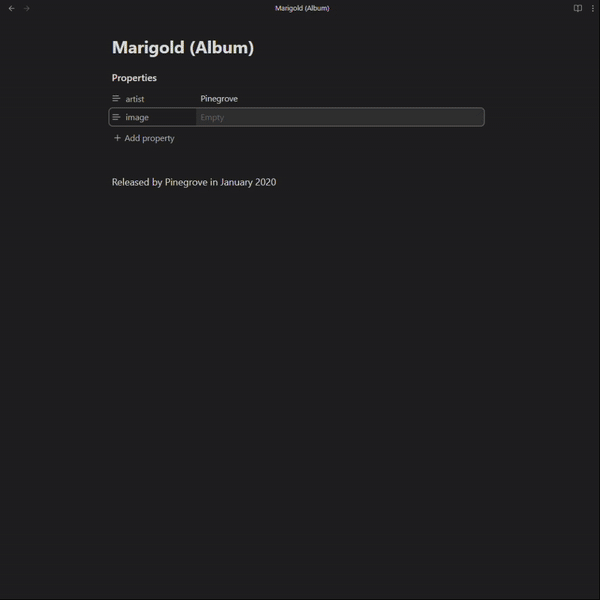

# Frontmatter Image Plugin for Obsidian

Automatically displays images using URLs stored in your frontmatter, with no manual image embedding required.

## Demo



## Features

- Automatically renders images from URLs in your frontmatter
- Supports configurable frontmatter keys
- Works in both Live Preview and Reading modes

## Usage

1. Add an image URL to your frontmatter:
   ```yaml
   ---
   url: https://example.com/your-image.jpg
   ---
   ```

2. The image will automatically appear below your frontmatter section.

## Configuration

In the plugin settings, enter the frontmatter keys you want to use for image URLs (one per line). The plugin will check each key in order and display the first image it finds.

## Installation

Install from the Obsidian Community Plugins browser by searching for "Frontmatter Image".

## License

[](https://opensource.org/licenses/MIT)

This project is licensed under the MIT License - see the [LICENSE](LICENSE) file for details.

## Support

Please report any issues or feature requests on the [GitHub repository](https://github.com/EzraMarks/obsidian-frontmatter-image).

Thanks for using the Frontmatter Image plugin for Obsidian!